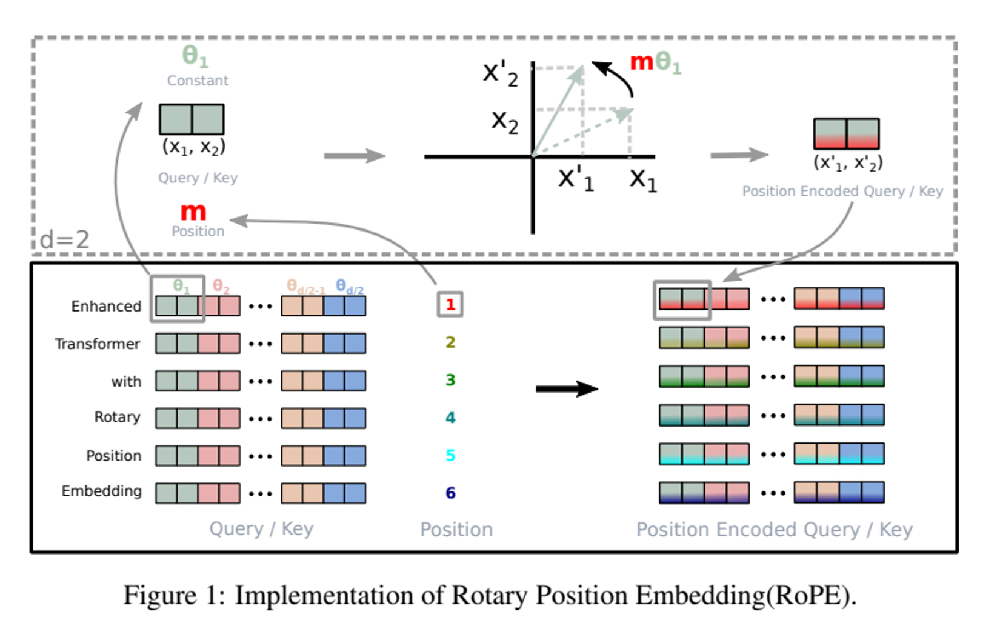
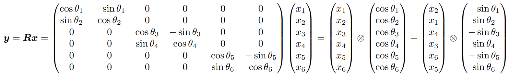
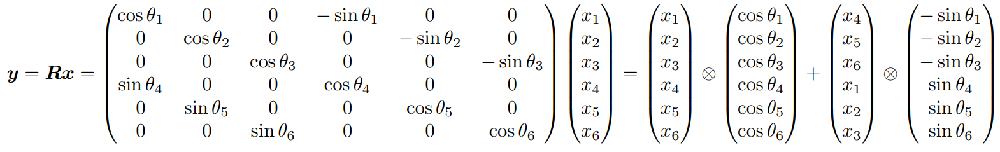
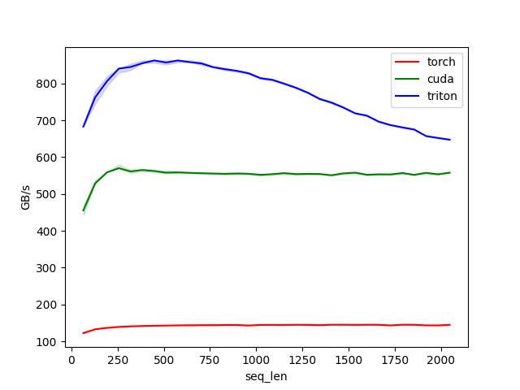
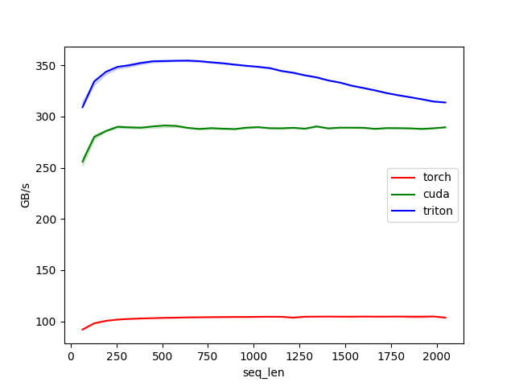

# AI Compiler Study
본 repo는 [김태훈](http://taehoon.ai)님이 모집 중이신 [AI Compiler Study](https://carpedm30.notion.site/AI-Compiler-Study-8d8a052c8a804a06af921ba4fded8432) 과제 제출을 위해 만들어졌습니다.



## RoPE (Rotary Positional Embedding) Implementation

개발 및 테스트 환경은 다음과 같습니다.
- RTX 3090
- torch 2.1.0
- triton 2.2.0

벤치마크는 아래 커맨드로 Docker 환경에서 실행하실 수 있습니다.  
벤치마크는 forward -> backward -> inference(torch-jit) 순으로 진행되며 벤치마크가 끝난 뒤 `pytest`로 테스트가 진행됩니다. (벤치마크 결과는 `results/` 디렉토리에서 확인하실 수 있습니다.)

```bash
git clone https://github.com/sjjeong94/ai_compiler_study.git
cd ai_compiler_study

# Docker Image를 빌드합니다.
make docker_image

# 벤치마크와 테스트를 실행합니다.
make run
```

### Code Link

- [`rope_fw` code](https://github.com/sjjeong94/ai_compiler_study/blob/main/aicom/positional_embedding.py#L6-L64)
- [`rope_bw` code](https://github.com/sjjeong94/ai_compiler_study/blob/main/aicom/positional_embedding.py#L67-L125)
- [Test code](../tests/test_rope.py)
- [Benchmark code](../scripts/benchmark.py)


### Forward

RoPE의 forward 연산은 아래처럼 풀어서 쓸 수 있습니다.



위 수식에서 rotate할 대상을 변경하면 아래와 같이 메모리 친화적으로 표현할 수 있습니다.



여기서 벡터를 두 그룹(1,2,3과 4,5,6)으로 나눈 뒤 Block Size는 d/2로 두고 구현을 진행하였습니다.  
Instance의 경우 Sequence(s), Batch(b), Head(h) dimension에 대해 나누어 병렬 연산을 하도록 구현하였습니다. ([`rope_fw` 코드](https://github.com/sjjeong94/ai_compiler_study/blob/main/aicom/positional_embedding.py#L6-L64))  
결과적으로 아래 그림과 같이 cuda 커널보다 더 빠른 성능을 보여주었습니다. (seq_len=2048, batch_size=16, num_heads=8, embed_dim=256 일 때, 약 16%의 성능 향상이 있었습니다.)




### Backward

RoPE의 backward 연산은 forward와 마찬가지로 아래처럼 풀어서 쓸 수 있습니다.


연산의 대부분이 forward와 동일하고, sin 파트에서 약간의 차이를 보이기 때문에 `rope_fw`에서 해당 연산 부분만 수정하여 구현하였습니다. ([`rope_bw` 코드](https://github.com/sjjeong94/ai_compiler_study/blob/main/aicom/positional_embedding.py#L67-L125))  
벤치마크 결과 forward와 마찬가지로 cuda 커널보다 더 빠른 성능을 보여주었습니다. (seq_len=2048, batch_size=16, num_heads=8, embed_dim=256 일 때, 약 8%의 성능 향상이 있었습니다.)



### Further Optimization?
경험 부족으로 구체적인 Profiling을 진행하지는 못 했지만 cos, sin 연산 시간의 많은 부분을 차지할 것으로 예상하고 있습니다. 기회가 된다면 해당 부분에 대한 pre-computation을 먼저 진행한 결과와 비교해볼 생각입니다.


## References

- [RoPE Paper](https://arxiv.org/abs/2104.09864)
- [RoPE CUDA](https://github.com/NVIDIA/TransformerEngine/blob/main/transformer_engine/common/fused_rope/fused_rope.cu)
- [Triton](https://triton-lang.org/)
